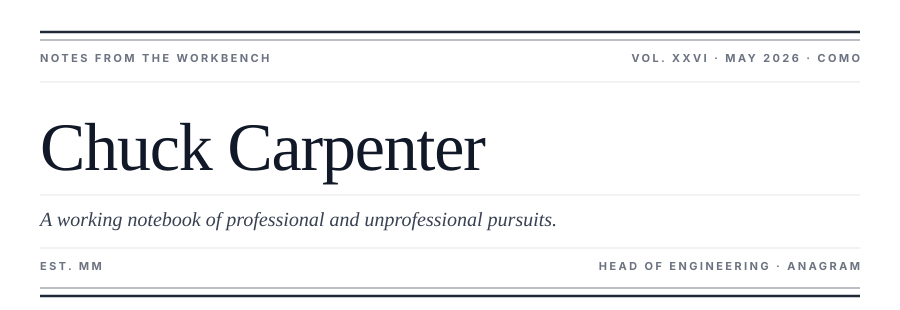
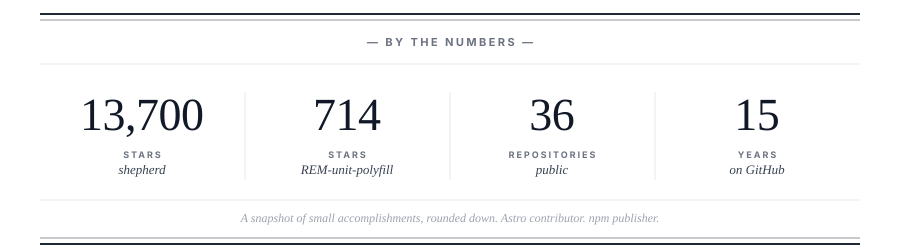

<p align="center">
  
</p>

### vocation

I am Head of Engineering at [Anagram](https://www.anagramsecurity.com), where we build security awareness training that does not insult the people taking it — gamified, evidence-backed, with phishing simulations driven by language models that are, occasionally, smarter than the people they are testing. Previously partner at ShipShape, now dormant; the work that came out of it remains useful.

### open source

I maintain [**shepherd**](https://github.com/shipshapecode/shepherd), a JavaScript library for guided product tours. It has been quietly walking users through software since 2014. I contribute to [Astro](https://astro.build) core and to [Swach](https://swach.io).

### avocation

I sometimes co-host [**whiskey.fm**](https://whiskey.fm), a podcast about the trade and the spirit. I live in Como. I am learning Italian, slowly, and building a homelab, more slowly. I support Manchester United and so should you.

---

### reach

[linkedin](https://www.linkedin.com/in/chuckcarpenter/) &nbsp;·&nbsp; [x](https://x.com/chuckcarpenter) &nbsp;·&nbsp; [npm](https://www.npmjs.com/~chuckcarpenter)

### card

```
npx chuckcarpenter
```

<sub>A terminal-rendered version of this page, for the discerning command-line reader.</sub>

<p align="center">
  
</p>

<p align="center">
  
</p>
